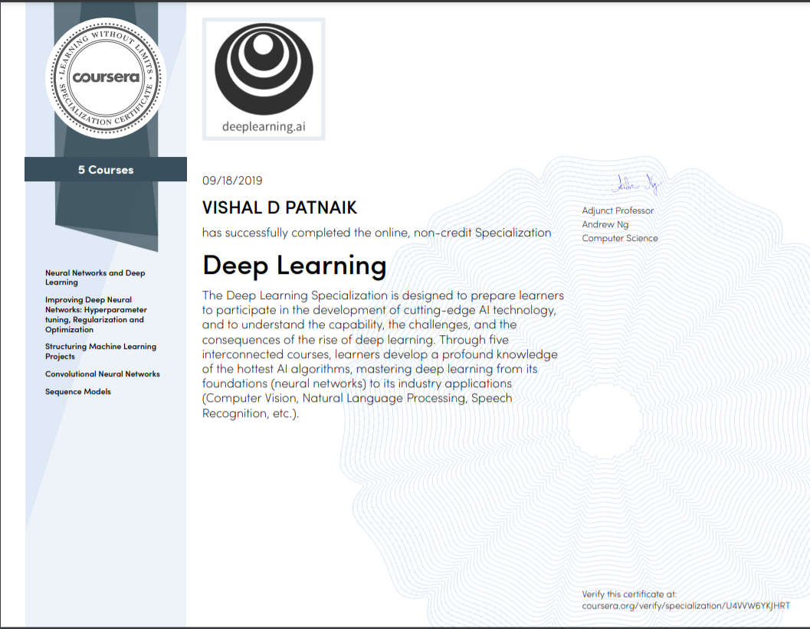

--------------------------------------------------------------------------------
### 1. Neural Network and Deep Learning
* Week 1
	* [Quiz 1 - Introduction to deep learning](https://github.com/VishalPatnaik/Deep-Learning/blob/main/Deep%20Learning/1%20Neural%20Networks%20and%20Deep%20Learning/Week1/Introduction%20to%20deep%20learning/week1%20quiz.md)
	* [Building your Deep Neural Network: Step by Step](https://github.com/VishalPatnaik/Deep-Learning/blob/main/Deep%20Learning/1%20Neural%20Networks%20and%20Deep%20Learning/Week1/Introduction%20to%20deep%20learning/Building%20your%20Deep%20Neural%20Network%20-%20Step%20by%20Step/Building%20your%20Deep%20Neural%20Network%20-%20Step%20by%20Step.ipynb)
		Outcomes:
			1. Use non-linear units like ReLU to improve your model
			2. Build a deeper neural network (with more than 1 hidden layer)
			3. Implement an easy-to-use neural network class

* Week 2
	* [Quiz 2 - Neural Network Basics](https://github.com/VishalPatnaik/Deep-Learning/blob/main/Deep%20Learning/1%20Neural%20Networks%20and%20Deep%20Learning/Week2/Neural%20Networks%20Basics/week2%20quiz.md)
	* [Logistic Regression as a Neural Network](https://github.com/VishalPatnaik/Deep-Learning/blob/main/Deep%20Learning/1%20Neural%20Networks%20and%20Deep%20Learning/Week2/Neural%20Networks%20Basics/Logistic%20Regression%20as%20a%20Neural%20Network/Logistic%20Regression%20with%20a%20Neural%20Network%20mindset.ipynb)
		Outcomes:
			1. Build the general architecture of a learning algorithm, including:
				*	Initializing parameters
				*	Calculating the cost function and its gradient
				*	Using an optimization algorithm (gradient descent)
			2. Gather all three functions above into a main model function, in the right order.

* Week 3
	* [Quiz 3 - Shallow Neural Networks](https://github.com/VishalPatnaik/Deep-Learning/blob/main/Deep%20Learning/1%20Neural%20Networks%20and%20Deep%20Learning/Week3/week3%20quiz.md)
	* [Planar data classification with one hidden layer](https://github.com/VishalPatnaik/Deep-Learning/blob/main/Deep%20Learning/1%20Neural%20Networks%20and%20Deep%20Learning/Week3/Planar%20data%20classification%20with%20one%20hidden%20layer/Planar%20data%20classification%20with%20one%20hidden%20layer.ipynb)
		Outcomes:
			1. Implement a 2-class classification neural network with a single hidden layer
			2. Use units with a non-linear activation function, such as tanh
			3. Compute the cross entropy loss
			4. Implement forward and backward propagation

* Week 4
	* [Quiz 4 - Key concepts on Deep Neural Networks](https://github.com/VishalPatnaik/Deep-Learning/blob/main/Deep%20Learning/1%20Neural%20Networks%20and%20Deep%20Learning/Week4/week4%20quiz.md)
	* [Deep Neural Network for Image Classification: Application](https://github.com/VishalPatnaik/Deep-Learning/blob/main/Deep%20Learning/1%20Neural%20Networks%20and%20Deep%20Learning/Week4/Deep%20Neural%20Network%20Application-Image%20Classification/Deep%2BNeural%2BNetwork%2B-%2BApplication%2Bv8.ipynb)
		Outcomes:
			1. Building and applying a deep neural network to supervised learning.

### 2. Improving Deep Neural Networks-Hyperparameter tuning, Regularization and Optimization
* Week 1
	* [Quiz 1 - Practical aspects of deep learning](https://github.com/VishalPatnaik/Deep-Learning/blob/main/Deep%20Learning/2%20Improving%20Deep%20Neural%20Networks/Week1/week1%20quiz.md)
	* [Initialization](https://github.com/VishalPatnaik/Deep-Learning/blob/main/Deep%20Learning/2%20Improving%20Deep%20Neural%20Networks/Week1/Initialization/Initialization.ipynb)
	* [Regularization](https://github.com/VishalPatnaik/Deep-Learning/blob/main/Deep%20Learning/2%20Improving%20Deep%20Neural%20Networks/Week1/Regularization/Regularization%2B-%2Bv2.ipynb)
		Outcomes:
			1. Regularization in your deep learning models.
	* [Gradient Checking](https://github.com/VishalPatnaik/Deep-Learning/blob/main/Deep%20Learning/2%20Improving%20Deep%20Neural%20Networks/Week1/Gradient%20Checking/Gradient%2BChecking%2Bv1.ipynb)
		Outcomes:
			1. Implementation and using gradient checking.

* Week 2
	* [Quiz 2 - Optimization algorithms](https://github.com/VishalPatnaik/Deep-Learning/blob/main/Deep%20Learning/2%20Improving%20Deep%20Neural%20Networks/Week2/week2%20quiz.md)
	* [Optimization](https://github.com/VishalPatnaik/Deep-Learning/blob/main/Deep%20Learning/2%20Improving%20Deep%20Neural%20Networks/Week2/Optimization/Optimization%2Bmethods.ipynb)

* Week 3
	* [Quiz 3 - Hyperparameter tuning, Batch Normalization, Programming Frameworks](https://github.com/VishalPatnaik/Deep-Learning/blob/main/Deep%20Learning/2%20Improving%20Deep%20Neural%20Networks/Week3/week3%20quiz.md) 
	* [Tensorflow](https://github.com/VishalPatnaik/Deep-Learning/blob/main/Deep%20Learning/2%20Improving%20Deep%20Neural%20Networks/Week3/Tensorflow/Tensorflow%2BTutorial%2Bv3a.ipynb)

### 3. Structuring Machine Learning Projects
* Week 1
	* [Quiz 1 - Bird recognition in the city of Peacetopia (case study)](https://github.com/VishalPatnaik/Deep-Learning/blob/main/Deep%20Learning/3%20Structuring%20Machine%20Learning%20Projects/Week1/Week%201%20Quiz%20-%20Bird%20recognition%20in%20the%20city%20of%20Peacetopia%20(case%20study).md)

* Week 2
	* [Quiz 2 - Autonomous driving (case study)](https://github.com/VishalPatnaik/Deep-Learning/blob/main/Deep%20Learning/3%20Structuring%20Machine%20Learning%20Projects/Week2/Week%202%20Quiz%20-%20Autonomous%20driving%20(case%20study).md)

### 4. Convolutional Neural Network
* Week 1
	* [Quiz 1 - The basics of ConvNets](https://github.com/VishalPatnaik/Deep-Learning/blob/main/Deep%20Learning/4%20Convulutional%20Neural%20Networks/Week1/week1%20quiz.md)
	* [Convolutional Neural Networks: Application](https://github.com/VishalPatnaik/Deep-Learning/blob/main/Deep%20Learning/4%20Convulutional%20Neural%20Networks/Week1/Convulutional%20Model/Convolution%2Bmodel%2B-%2BApplication%2B-%2Bv1.ipynb)
		Outcomes:
			1. Build and train a ConvNet in TensorFlow for a classification problem
	* [Convolutional Model- step by step](https://github.com/VishalPatnaik/Deep-Learning/blob/main/Deep%20Learning/4%20Convulutional%20Neural%20Networks/Week1/Convulutional%20Model/Convolution%2Bmodel%2B-%2BStep%2Bby%2BStep%2B-%2Bv2.ipynb)

* Week 2
	* [Quiz 2 - Deep convolutional models](https://github.com/VishalPatnaik/Deep-Learning/blob/main/Deep%20Learning/4%20Convulutional%20Neural%20Networks/Week2/week2%20quiz.md)
	* [ResNets](https://github.com/VishalPatnaik/Deep-Learning/blob/main/Deep%20Learning/4%20Convulutional%20Neural%20Networks/Week2/ResNets/Residual%2BNetworks%2B-%2Bv2.ipynb)
		Outcomes:
			1. Implement the basic building blocks of ResNets.
			2. Put together these building blocks to implement and train a state-of-the-art neural network for image classification.

* Week 3
	* [Quiz 3 - Detection algorithms](https://github.com/VishalPatnaik/Deep-Learning/blob/main/Deep%20Learning/4%20Convulutional%20Neural%20Networks/Week3/week3%20quiz.md)
	* [Car detection for Autonomous Driving](https://github.com/VishalPatnaik/Deep-Learning/blob/main/Deep%20Learning/4%20Convulutional%20Neural%20Networks/Week3/Car%20detection%20for%20Autonomous%20Driving/Autonomous%2Bdriving%2Bapplication%2B-%2BCar%2Bdetection%2B-%2Bv3.ipynb)
		Outcomes:
			1. Use object detection on a car detection dataset
			2. Deal with bounding boxes

* Week 4
	* [Quiz 4 - Special applications: Face recognition & Neural style transfer](https://github.com/VishalPatnaik/Deep-Learning/blob/main/Deep%20Learning/4%20Convulutional%20Neural%20Networks/Week4/week4%20quiz.md)
	* [Neural Style Transfer](https://github.com/HeroKillerEver/coursera-deep-learning/tree/master/Convolutional%20Neural%20Networks/Neural%20Style%20Transfer)
	* [Face Recognition](https://github.com/VishalPatnaik/Deep-Learning/blob/main/Deep%20Learning/4%20Convulutional%20Neural%20Networks/Week4/Face%20Recognition/Face%2BRecognition%2Bfor%2Bthe%2BHappy%2BHouse%2B-%2Bv3.ipynb)
		Outcomes:
			1. Implement the triplet loss function
			2. Use a pretrained model to map face images into 128-dimensional encodings
			3. Use these encodings to perform face verification and face recognition

### 5. Sequence Models
* Week 1
	* [Quiz 1 - Recurrent Neural Networks](https://github.com/VishalPatnaik/Deep-Learning/blob/main/Deep%20Learning/5%20Sequence%20Models/Week1/week1%20quiz.md)
	* [Building a Recurrent Neural Network - Step by Step](https://github.com/VishalPatnaik/Deep-Learning/blob/main/Deep%20Learning/5%20Sequence%20Models/Week1/Building%20a%20Recurrent%20Neural%20Network%20-%20Step%20by%20Step/Building%2Ba%2BRecurrent%2BNeural%2BNetwork%2B-%2BStep%2Bby%2BStep%2B-%2Bv3.ipynb)
	* [Dinosaur Island -- Character-level language model](https://github.com/VishalPatnaik/Deep-Learning/blob/main/Deep%20Learning/5%20Sequence%20Models/Week1/Dinosaur%20Island%20--%20Character-level%20language%20model/Dinosaurus%2BIsland%2B--%2BCharacter%2Blevel%2Blanguage%2Bmodel%2Bfinal%2B-%2Bv3.ipynb)
		Outcomes:
			1. Store text data for processing using an RNN
			2. Synthesize data, by sampling predictions at each time step and passing it to the next RNN-cell unit
			3. Build a character-level text generation recurrent neural network
			4. Importance of gradient clipping
	* [Jazz improvisation with LSTM](https://github.com/VishalPatnaik/Deep-Learning/blob/main/Deep%20Learning/5%20Sequence%20Models/Week1/Jazz%20improvisation%20with%20LSTM/Improvise%2Ba%2BJazz%2BSolo%2Bwith%2Ban%2BLSTM%2BNetwork%2B-%2Bv3.ipynb)
		Outcomes:
			1. Apply an LSTM to music generation.
			2. Generate your own jazz music with deep learning.

* Week 2
	* [Quiz 2 - Sequence models & Attention mechanism](https://github.com/VishalPatnaik/Deep-Learning/blob/main/Deep%20Learning/5%20Sequence%20Models/Week2/week2%20quiz.md)
	* [Operations on word vectors](https://github.com/VishalPatnaik/Deep-Learning/blob/main/Deep%20Learning/5%20Sequence%20Models/Week2/Word%20Vector%20Representation/Operations%2Bon%2Bword%2Bvectors%2B-%2Bv2.ipynb)
		Outcomes:
			1. Load pre-trained word vectors, and measure similarity using cosine similarity
			2. Use word embeddings to solve word analogy problems such as Man is to Woman as King is to __.
			3. Modify word embeddings to reduce their gender bias
	* [Emojify](https://github.com/VishalPatnaik/Deep-Learning/blob/main/Deep%20Learning/5%20Sequence%20Models/Week2/Emojify/Emojify%2B-%2Bv2.ipynb)

* Week 3
	* [Quiz 3 - Sequence models & Attention mechanism](https://github.com/VishalPatnaik/Deep-Learning/blob/main/Deep%20Learning/5%20Sequence%20Models/Week3/week3%20quiz.md)
	* [Machine Translation](https://github.com/VishalPatnaik/Deep-Learning/blob/main/Deep%20Learning/5%20Sequence%20Models/Week3/Machine%20Translation/Neural%2Bmachine%2Btranslation%2Bwith%2Battention%2B-%2Bv4.ipynb)
	* [Trigger Word Detection](https://github.com/VishalPatnaik/Deep-Learning/blob/main/Deep%20Learning/5%20Sequence%20Models/Week3/Trigger%20word%20detection/Trigger%2Bword%2Bdetection%2B-%2Bv1.ipynb)
		Outcomes:
			1. Structure a speech recognition project
			2. Synthesize and process audio recordings to create train/dev datasets
			3. Train a trigger word detection model and make predictions

 

### Specialization Completion Certificate

### Author
Viahal Patnaik/ [@VISHAL](https://github.com/VishalPatnaik)
